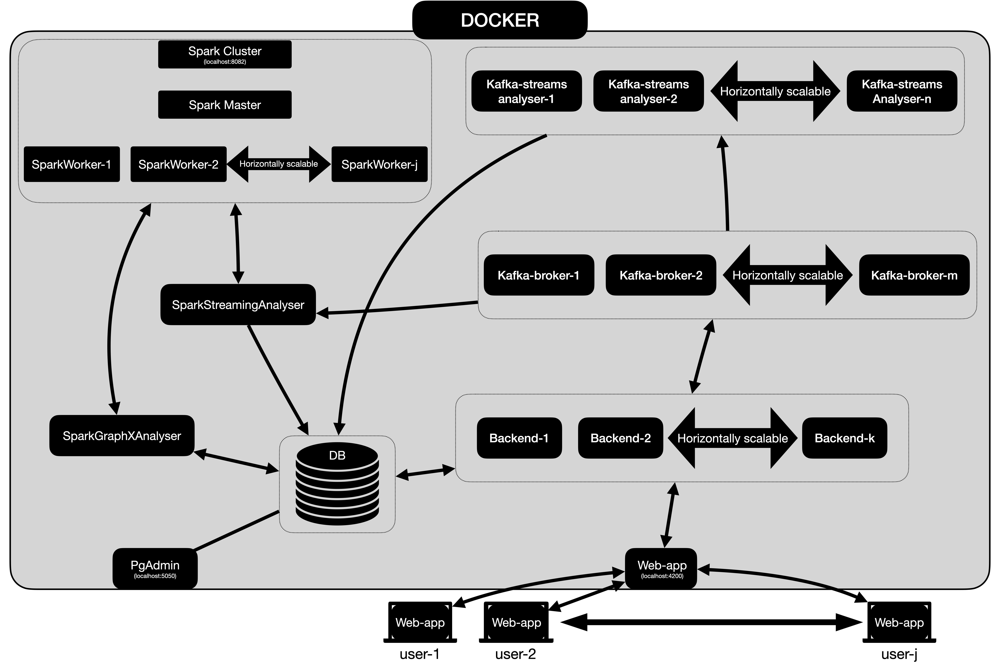

# Kessenger

## What the project is

Project is simple, scalable chat application built with [Kafka](https://kafka.apache.org/), [Play](https://www.playframework.com/),
[Angular](https://angular.io/), [Spark](https://spark.apache.org/) ([Streaming](https://spark.apache.org/streaming/) 
and [GraphX](https://spark.apache.org/graphx/)), [PostgreSQL](https://www.postgresql.org/) 
and [pgAdmin](https://www.pgadmin.org/). Whole system is containerized with [Docker](https://www.docker.com/).


## Project Architecture



## Before running project 

To build and run this project you need installed:

- [Java JDK 11](https://adoptopenjdk.net/) at leased. 
- [SBT](https://www.scala-sbt.org/).
- [Docker](https://www.docker.com/).

 
## Running project

Simply open terminal/console and go to project folder. Then make scripts executable:

```bash
chmod +x kessenger
chmod +x stopkessenger
```

Be sure that docker is running and start building script:

```bash
./kessenger
```

Wait to building will end and then open new browser window or tab and go to `localhost:4200`. 

> **Note!** <br>
> First call with containers building takes some time. 

Then open another browser and go to `localhost:4200` too. In both browsers create two different users and then create chat between them.

## Running dev
If you want to run system in dev mode run kessenger script with dev option: 

```bash
./kessenger --env=dev
```

then open two new terminal windows, and run `devRunBackend`

```bash
./devRunBackend
```

and `devRunWebapp` scripts.

```bash
./devRunWebapp
```
