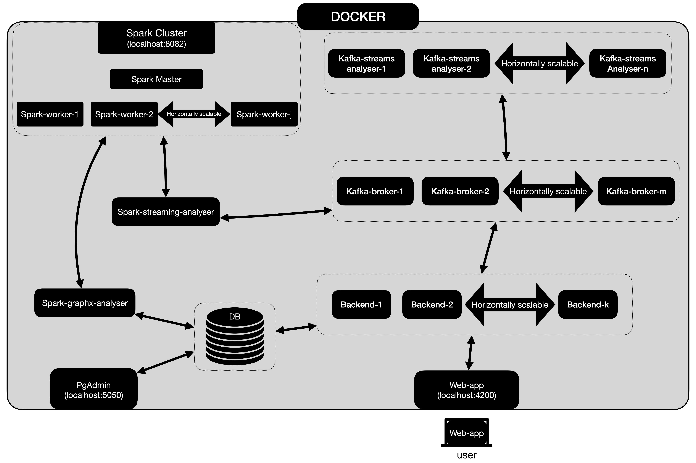

# Kessenger

## What the project is

Project is simple, horizontally-scalable chat application built with [Kafka](https://kafka.apache.org/), [Play](https://www.playframework.com/), [Angular](https://angular.io/),
[Spark](https://spark.apache.org/) ([Streaming](https://spark.apache.org/streaming/), [GraphX](https://spark.apache.org/graphx/)), [PostgreSQL](https://www.postgresql.org/) 
and [pgAdmin](https://www.pgadmin.org/). Whole system is containerized with [Docker](https://www.docker.com/).


## Project Architecture



## Before Project Running 

To build and run this project you need installed:

- [Java JDK 11](https://adoptopenjdk.net/) at leased. 
- [SBT](https://www.scala-sbt.org/).
- [Docker](https://www.docker.com/).

 
## Running Project

Download zip file of repository from this page (green 'code' button above), unpack, open terminal/console, 
go to unpacked project folder and then make starting script executable (Mac):

```zsh
chmod +x kessengerZsh
```
or
```bash
chmod +x kessengerBash
```
in Linux systems with bash shell.

Be sure that docker is running and run building script:

```zsh
./kessengerZsh
```


Wait building process will finish and then open new browser window or tab and go to `localhost:4200`. 

> **Note!** <br>
> First build will take some time (several minutes).

Then open *another browser* and go to `localhost:4200` too. In both browsers create two different users and then create 
chat between them (group chat between more than two users possible too).

## System Details
### Built-in Load Balancer
System has built-in Load Balancer protecting user against service inaccessibility in case of current connected backend crash.
In such case one of other (working) backend services is randomly selected and current users app state is rebuilt in it. 

### Akka Actor System
Core communication between frontend and backend is performed via [WS](https://en.wikipedia.org/wiki/WebSocket) connection. 
Backend has Akka 
Actor System designed to handling communication via WS connection. Each action send via WS is handled by WS Parent 
Actor and delegated to specific child Actor. As mentioned in [Built-in Load Balancer](#built-in-load-balancer) section, 
in case of backend crash, whole Actor System is rebuilt in another working backend service and the state of this Actor 
System is retained.  


### Spark Analysers
**Spark-streaming-analyser** and **Spark-graphx-analyser** are [driver apps](https://spark.apache.org/docs/latest/cluster-overview.html) 
running within Spark Cluster. **Spark-streaming-analyser** is simple streaming application, which polls data from kafka brokers, 
analyses and saves calculated results back (in real time) to specific topic in kafka brokers. 

To check saved analysis read data from kafka running script with kafka topic name as argument:

```zsh
./topicContentZsh avg_server_delay_by_user
```

For example in this topic we save information of message delay (in ms) between sending them by user and receiving by server. 

**Spark-graphx-analyser** 
 app takes users data from database and calculates page rank of each user based on number of users chats. 
Calculated result is saved back to database. 

#### Running Analysers
**Spark-streaming-analyser** and **Spark-graphx-analyser** do not start with system right away. They need data to 
operate, so it is required to run them when some data are generated and saved in kafka. Both applications are runnable with scripts:

```zsh
./runSparkStreamingAnalyserZsh
./runGraphAnalyserZsh
```

These scripts build docker images and create containers which are thereafter connected to existing inner docker network. 


### Kafka Streaming Analyser
This part of system is Kafka Streaming application which calculates simple time windowed operations and saves  
results back to kafka broker. 

As in case of [**Spark-streaming-analyser**](#spark-analysers) it is simple to check analysis results 
looking at topics contents, for example:   

```zsh
./topicContentZsh average-number-of-words-in-message-within-1-minute-per-zone
```

### Database state
System gives possibility to monitor Database state using PgAdmin. To check it, open new browser tab and go to 
`localhost:5050`. Sign in with defined Admin credentials and configure database connection. 
Then you can check tables content, currently running queries, manually modify database and so on. 


### Spark Cluster state
Open new browser tab and go to `localhost:8082`. Here you can find information of all submitted, running and
finished Spark applications as well Spark Workers condition.

### Logs
In case of system ERRORs and WARNs, logs are saved to files and easily accessible. 
Go to your HOME folder and open created Kessenger/logs directory. Each part of system saves logs to
file in different folder, so it is simple to check logs only from specific part of system.  

## Shut Down and Cleaning System
If you run system with `./kessengerZsh` script, you can shut down whole system using command below

```zsh
./stopkessengerZsh
```

This script stops and removes all containers, and then removes built docker images, so no disk space is wasted for 
keeping unused docker stuff.   